# 2단계-2. ERD 정식화 (Entity-Relationship Design)

> 기반 문서: `docs/design/00-work-order.md` §3(ERD 개요), §7(사용자 결정사항),
> `docs/recon/01-data-source-analysis.md` §2(SSOT 재정리표), §4(SQ 정의), §5(ML 방법론 최종권장안)
>
> 원칙:
> - **1단계(MVP) 범위만 정식 스키마로 설계**한다. 2단계 이후 테이블은 6장에 "스켈레톤"만 정리하고 컬럼 상세는 생략한다.
> - 1단계 테이블 안에 2단계에서만 채워질 컬럼이 존재하는 경우(예: `certificate_coa`의 블록체인 해시), 컬럼은 스키마에
>   남겨두되 주석으로 **"2단계 예정"**을 명시한다.
> - 참고 기술스택: PostgreSQL 16, Spring Boot 3.3.4/Java 21 + Spring Data JPA, Flyway 마이그레이션 전제.
> - 멀티테넌트 격리: 모든 업무 데이터 테이블은 `org_id`(직접 또는 `batch_id`를 경유한 간접 참조)로 테넌트를 구분한다.
>   조회 시 `org_id` 필터링은 애플리케이션 레이어(Spring Security 인증 컨텍스트 기반 자동 바인딩) + DB 레벨 Row 정책
>   병행을 권장한다(1단계는 애플리케이션 레이어 필터링 우선, RLS는 2단계에서 검토).

---

## 목차

1. [1단계 ERD 관계도 (Mermaid)](#1-1단계-erd-관계도-mermaid)
2. [A. 조직/사용자 (Tenant & RBAC)](#2-a-조직사용자-tenant--rbac)
3. [B. 마스터 데이터 (Metadata)](#3-b-마스터-데이터-metadata)
4. [C. 공정 실행 데이터 (Synthesis Batch)](#4-c-공정-실행-데이터-synthesis-batch)
5. [D. 품질측정 데이터 (QC Measurement)](#5-d-품질측정-데이터-qc-measurement)
6. [G. ML 예측/진단 (1단계부터 반영)](#6-g-ml-예측진단-1단계부터-반영)
7. [F. 이력/감사 (Audit)](#7-f-이력감사-audit)
8. [qc_threshold_spec 시드 데이터](#8-qc_threshold_spec-시드-데이터)
9. [2단계 이후 예정 테이블 (스켈레톤)](#9-2단계-이후-예정-테이블-스켈레톤)
10. [테이블 개수 요약](#10-테이블-개수-요약)

---

## 1. 1단계 ERD 관계도 (Mermaid)

```mermaid
erDiagram
    ORGANIZATION ||--o{ USER_ACCOUNT : "소속"
    ORGANIZATION ||--o{ SYNTHESIS_BATCH : "실행"
    ORGANIZATION ||--o{ QC_THRESHOLD_SPEC : "전용기준(선택)"
    ORGANIZATION ||--o{ ACTION_LOG : "행위발생"

    USER_ACCOUNT }o--|| ROLE_PERMISSION : "역할별 권한"
    USER_ACCOUNT ||--o{ SYNTHESIS_BATCH : "담당(operator)"
    USER_ACCOUNT ||--o{ QC_MEASUREMENT : "측정자"
    USER_ACCOUNT ||--o{ ACTION_LOG : "행위자"

    EQUIPMENT_MODEL ||--o{ SYNTHESIS_BATCH : "사용장비"
    SUBSTRATE ||--o{ SYNTHESIS_BATCH : "사용기판"
    RAW_MATERIAL ||--o{ SYNTHESIS_BATCH : "주원료(1단계 단순화)"
    MEASUREMENT_EQUIPMENT ||--o{ QC_MEASUREMENT : "측정장비"
    MEASUREMENT_EQUIPMENT ||--o{ RAMAN_SPECTRUM_RAW : "측정장비"

    SYNTHESIS_BATCH ||--o{ SYNTHESIS_PROCESS_PARAM : "시계열 파라미터"
    SYNTHESIS_BATCH ||--o{ QC_MEASUREMENT : "측정결과"
    SYNTHESIS_BATCH ||--o{ RAMAN_SPECTRUM_RAW : "라만 원본"
    SYNTHESIS_BATCH ||--o{ ML_PREDICTION_LOG : "예측대상"

    ML_MODEL_VERSION ||--o{ ML_PREDICTION_LOG : "사용모델"

    QC_THRESHOLD_SPEC }o..o{ QC_MEASUREMENT : "판정기준(느슨한 참조, metric_code)"

    ORGANIZATION {
        bigint org_id PK
        varchar org_code UK
        varchar org_type "PRODUCER_GRAPHENE_ELECTRIC/ADOPTER/ADMIN"
        varchar org_name
        varchar industry_type "ADOPTER 소속 산업분류"
        varchar status "PENDING/ACTIVE/SUSPENDED"
    }
    USER_ACCOUNT {
        bigint user_id PK
        bigint org_id FK
        varchar login_id UK
        varchar role "PROCESS_ENGINEER/OPERATOR/PLATFORM_ADMIN"
        varchar status
    }
    ROLE_PERMISSION {
        bigint permission_id PK
        varchar role
        varchar module
        boolean can_view
        boolean can_create
        boolean can_edit
        boolean can_delete
    }
    EQUIPMENT_MODEL {
        bigint equipment_model_id PK
        varchar model_code UK
        varchar equipment_type "T_CVD/PECVD/LPCVD/APCVD/R2R/AIR_JET_MILL"
        varchar process_type "BATCH/R2R"
    }
    RAW_MATERIAL {
        bigint raw_material_id PK
        varchar material_code UK
        varchar material_type "GAS/LIQUID_PRECURSOR/SOLID"
        numeric purity_pct
        varchar lot_no
    }
    SUBSTRATE {
        bigint substrate_id PK
        varchar substrate_code UK
        varchar substrate_type "CU_WIRE/CU_STRAND/BUSBAR/SIO2_WAFER/..."
        numeric cross_section_mm2 "SQ=연선 총단면적(mm2) 정의"
        int strand_count
    }
    MEASUREMENT_EQUIPMENT {
        bigint measurement_equipment_id PK
        varchar equipment_code UK
        varchar equipment_type "RAMAN/SEM/AFM/EBSD/FOUR_PROBE/IR_CAMERA/BULGE_TESTER"
    }
    QC_THRESHOLD_SPEC {
        bigint threshold_id PK
        varchar metric_code
        varchar spec_type "TARGET_STAGE1/TARGET_STAGE2/VALIDATED_ACHIEVEMENT"
        varchar comparator
        numeric threshold_value
        bigint org_id FK "NULL=플랫폼 공통기준"
    }
    SYNTHESIS_BATCH {
        bigint batch_id PK
        bigint org_id FK
        varchar batch_no
        bigint equipment_model_id FK
        bigint substrate_id FK
        bigint raw_material_id FK
        varchar process_type "BATCH/R2R"
        varchar status
        bigint operator_user_id FK
    }
    SYNTHESIS_PROCESS_PARAM {
        bigint param_id PK
        bigint batch_id FK
        varchar param_name "CHAMBER_TEMP_C/CH4_FLOW_SCCM/..."
        numeric param_value
        timestamp recorded_at
    }
    QC_MEASUREMENT {
        bigint qc_measurement_id PK
        bigint batch_id FK
        varchar metric_code
        numeric measured_value
        bigint measurement_equipment_id FK
        varchar judged_result "PASS/FAIL"
        bigint measured_by_user_id FK
    }
    RAMAN_SPECTRUM_RAW {
        bigint spectrum_id PK
        bigint batch_id FK
        bigint measurement_equipment_id FK
        jsonb wavenumber_array
        jsonb intensity_array
        varchar raw_file_path
    }
    ML_MODEL_VERSION {
        bigint model_id PK
        varchar target_metric_code
        varchar algorithm "GPR/RANDOM_FOREST/LINEAR_REGRESSION/RULE_BASED_FALLBACK"
        varchar version_no
        int training_data_count
        numeric r2_score
        boolean is_active
    }
    ML_PREDICTION_LOG {
        bigint prediction_id PK
        bigint batch_id FK
        bigint model_id FK
        jsonb input_params_json
        numeric predicted_value
        numeric predicted_std_dev "GPR 신뢰구간"
        varchar confidence_level "HIGH/MEDIUM/LOW/DATA_INSUFFICIENT"
        numeric actual_value
        numeric residual
    }
    ACTION_LOG {
        bigint action_log_id PK
        bigint org_id FK
        bigint actor_user_id FK
        varchar module
        varchar action_type "CREATE/UPDATE/DELETE/LOGIN/LOGOUT"
        varchar target_entity
        jsonb before_data
        jsonb after_data
    }
```

---

## 2. A. 조직/사용자 (Tenant & RBAC)

### 2.1 `organization`

멀티테넌트의 최상위 격리 단위. `org_type`으로 그래핀일렉트릭 본사(PRODUCER)와 타산업 도입업체(ADOPTER)를 구분한다.

| 컬럼 | 타입 | 제약 | 설명 |
|---|---|---|---|
| org_id | BIGSERIAL | PK | 조직 ID |
| org_code | VARCHAR(50) | UNIQUE, NOT NULL | 조직 코드(로그인 시 사용) |
| org_type | VARCHAR(30) | NOT NULL, CHECK IN ('PRODUCER_GRAPHENE_ELECTRIC','ADOPTER','ADMIN') | 조직 유형. 연구단체/인증기관 유형은 2단계 예정 |
| org_name | VARCHAR(200) | NOT NULL | 조직명 |
| industry_type | VARCHAR(100) | NULL | ADOPTER 소속 산업분류(전기차/반도체/방열/섬유 등) |
| business_reg_no | VARCHAR(50) | NULL | 사업자등록번호 |
| status | VARCHAR(20) | NOT NULL, DEFAULT 'PENDING', CHECK IN ('PENDING','ACTIVE','SUSPENDED') | 온보딩 승인 상태 |
| contact_name | VARCHAR(100) | NULL | 담당자명 |
| contact_email | VARCHAR(200) | NULL | 담당자 이메일 |
| contact_phone | VARCHAR(50) | NULL | 담당자 연락처 |
| approved_by | BIGINT | NULL, FK → user_account(user_id) | 승인한 플랫폼관리자 |
| approved_at | TIMESTAMP | NULL | 승인 일시 |
| created_at | TIMESTAMP | NOT NULL, DEFAULT now() | |
| updated_at | TIMESTAMP | NOT NULL, DEFAULT now() | |

### 2.2 `user_account`

| 컬럼 | 타입 | 제약 | 설명 |
|---|---|---|---|
| user_id | BIGSERIAL | PK | 사용자 ID |
| org_id | BIGINT | NOT NULL, FK → organization(org_id) | 소속 조직 |
| login_id | VARCHAR(100) | UNIQUE, NOT NULL | 로그인 ID |
| password_hash | VARCHAR(255) | NOT NULL | BCrypt 해시 |
| role | VARCHAR(30) | NOT NULL, CHECK IN ('PROCESS_ENGINEER','OPERATOR','PLATFORM_ADMIN') | 1단계 단순화 역할. 연구단체/인증기관 역할은 2단계 예정 |
| name | VARCHAR(100) | NOT NULL | 이름 |
| email | VARCHAR(200) | UNIQUE, NULL | |
| phone | VARCHAR(50) | NULL | |
| status | VARCHAR(20) | NOT NULL, DEFAULT 'ACTIVE', CHECK IN ('ACTIVE','SUSPENDED') | |
| last_login_at | TIMESTAMP | NULL | |
| created_at / updated_at | TIMESTAMP | NOT NULL, DEFAULT now() | |

### 2.3 `role_permission`

CSMS `admin_role_permission` 패턴 재사용(모듈 단위 CRUD 권한 매트릭스).

| 컬럼 | 타입 | 제약 | 설명 |
|---|---|---|---|
| permission_id | BIGSERIAL | PK | |
| role | VARCHAR(30) | NOT NULL | user_account.role 값과 대응 |
| module | VARCHAR(50) | NOT NULL | 화면/기능 모듈 코드 (예: BATCH, QC, ML_REPORT, ORG_ADMIN, ACTION_LOG) |
| can_view | BOOLEAN | NOT NULL, DEFAULT false | |
| can_create | BOOLEAN | NOT NULL, DEFAULT false | |
| can_edit | BOOLEAN | NOT NULL, DEFAULT false | |
| can_delete | BOOLEAN | NOT NULL, DEFAULT false | |
| | | UNIQUE(role, module) | |

---

## 3. B. 마스터 데이터 (Metadata)

### 3.1 `equipment_model`

| 컬럼 | 타입 | 제약 | 설명 |
|---|---|---|---|
| equipment_model_id | BIGSERIAL | PK | |
| model_code | VARCHAR(50) | UNIQUE, NOT NULL | |
| model_name | VARCHAR(200) | NOT NULL | |
| equipment_type | VARCHAR(30) | NOT NULL, CHECK IN ('T_CVD','PECVD','LPCVD','APCVD','R2R','AIR_JET_MILL','OTHER') | |
| process_type | VARCHAR(20) | NOT NULL, CHECK IN ('BATCH','R2R') | 배치 vs 롤투롤 연속공정 |
| manufacturer | VARCHAR(200) | NULL | |
| spec_json | JSONB | NULL | 장비 세부 사양(자유 확장) |
| created_at / updated_at | TIMESTAMP | NOT NULL, DEFAULT now() | |

### 3.2 `raw_material`

| 컬럼 | 타입 | 제약 | 설명 |
|---|---|---|---|
| raw_material_id | BIGSERIAL | PK | |
| material_code | VARCHAR(50) | UNIQUE, NOT NULL | |
| material_name | VARCHAR(200) | NOT NULL | CH4/H2/Ar/벤젠/피리딘 등 |
| material_type | VARCHAR(30) | NOT NULL, CHECK IN ('GAS','LIQUID_PRECURSOR','SOLID') | |
| purity_pct | NUMERIC(6,3) | NULL | 가스 순도(%) |
| lot_no | VARCHAR(100) | NULL | 원료 LOT (2단계 LOT추적의 시드 컬럼, 1단계는 단순 기록용) |
| supplier | VARCHAR(200) | NULL | |
| created_at / updated_at | TIMESTAMP | NOT NULL, DEFAULT now() | |

### 3.3 `substrate`

> **SQ(연선굵기) 정의 확정** (recon §4): "연선의 (전체) 단면적", 1 SQ = 1 mm². Busbar는 단일도체 단면적에 관행적으로 적용.

| 컬럼 | 타입 | 제약 | 설명 |
|---|---|---|---|
| substrate_id | BIGSERIAL | PK | |
| substrate_code | VARCHAR(50) | UNIQUE, NOT NULL | |
| substrate_type | VARCHAR(30) | NOT NULL, CHECK IN ('CU_WIRE','CU_STRAND','BUSBAR','SIO2_WAFER','SI_WAFER','GE_SI_WAFER','PET','GLASS','QUARTZ','OTHER') | 연선/부스바 여부를 명시적으로 구분 |
| spec_designation | VARCHAR(100) | NULL | 규격 표기(A/B/C-Type 등) |
| cross_section_mm2 | NUMERIC(10,3) | NULL | SQ 값. "연선 총단면적(mm²)" 단일 정의로 표준화 |
| diameter_mm | NUMERIC(10,4) | NULL | 단선/케이블 직경 |
| strand_count | INT | NULL | 연선 가닥수 |
| created_at / updated_at | TIMESTAMP | NOT NULL, DEFAULT now() | |

### 3.4 `measurement_equipment`

| 컬럼 | 타입 | 제약 | 설명 |
|---|---|---|---|
| measurement_equipment_id | BIGSERIAL | PK | |
| equipment_code | VARCHAR(50) | UNIQUE, NOT NULL | |
| equipment_name | VARCHAR(200) | NOT NULL | |
| equipment_type | VARCHAR(30) | NOT NULL, CHECK IN ('RAMAN','SEM','AFM','EBSD','FOUR_PROBE','IR_CAMERA','BULGE_TESTER','OTHER') | |
| manufacturer | VARCHAR(200) | NULL | |
| calibration_due_date | DATE | NULL | |
| created_at / updated_at | TIMESTAMP | NOT NULL, DEFAULT now() | |

### 3.5 `qc_threshold_spec`

물성항목별 판정기준 마스터. **"참고 목표치"(1단계/2단계 이원화)** 와 **"SSOT 실측치"(창업중심대학 보고서 검증된 성과치)**
를 `spec_type`으로 명확히 구분한다(work order §3.2 갱신 공지 + recon §2 반영).

| 컬럼 | 타입 | 제약 | 설명 |
|---|---|---|---|
| threshold_id | BIGSERIAL | PK | |
| metric_code | VARCHAR(50) | NOT NULL | 물성항목 코드(§8 시드데이터 참고) |
| metric_name | VARCHAR(200) | NOT NULL | 물성항목명 |
| unit | VARCHAR(30) | NOT NULL | ratio/%/SQ/℃/%IACS 등 |
| spec_type | VARCHAR(30) | NOT NULL, CHECK IN ('TARGET_STAGE1','TARGET_STAGE2','VALIDATED_ACHIEVEMENT') | 참고목표치(1/2단계) vs 실측 검증치 구분 |
| comparator | VARCHAR(10) | NOT NULL, CHECK IN ('<=','>=','=','RANGE') | 판정 연산자 |
| threshold_value | NUMERIC(12,4) | NULL | 기준값(또는 RANGE 하한) |
| threshold_value_max | NUMERIC(12,4) | NULL | RANGE 상한(해당시) |
| source_doc | VARCHAR(300) | NULL | 근거 문서명(예: "제일테크노스 연구개발계획서", "2025년 창업중심대학 최종보고서") |
| org_id | BIGINT | NULL, FK → organization(org_id) | NULL이면 플랫폼 공통기준, 특정 조직 전용 기준이면 지정 |
| effective_from | DATE | NULL | 기준 발효일 |
| created_at / updated_at | TIMESTAMP | NOT NULL, DEFAULT now() | |
| | | UNIQUE(metric_code, spec_type, org_id) | |

---

## 4. C. 공정 실행 데이터 (Synthesis Batch)

### 4.1 `synthesis_batch`

| 컬럼 | 타입 | 제약 | 설명 |
|---|---|---|---|
| batch_id | BIGSERIAL | PK | |
| org_id | BIGINT | NOT NULL, FK → organization(org_id) | 테넌트 격리 키 |
| batch_no | VARCHAR(100) | NOT NULL | 사람이 읽는 배치 번호(조직 내 유니크) |
| equipment_model_id | BIGINT | NOT NULL, FK → equipment_model | |
| substrate_id | BIGINT | NOT NULL, FK → substrate | |
| raw_material_id | BIGINT | NULL, FK → raw_material | 주 원료. 다중 원료 매핑(batch_raw_material)은 2단계에서 정규화 검토, 1단계는 단순화 |
| process_type | VARCHAR(20) | NOT NULL, CHECK IN ('BATCH','R2R') | |
| started_at | TIMESTAMP | NULL | |
| ended_at | TIMESTAMP | NULL | |
| status | VARCHAR(20) | NOT NULL, DEFAULT 'PLANNED', CHECK IN ('PLANNED','RUNNING','COMPLETED','FAILED','ABORTED') | |
| operator_user_id | BIGINT | NULL, FK → user_account(user_id) | |
| recipe_version | VARCHAR(50) | NULL | 자유텍스트 기록. 정식 버전관리(`recipe_version_history`)는 2단계 예정 |
| notes | TEXT | NULL | |
| created_at / updated_at | TIMESTAMP | NOT NULL, DEFAULT now() | |
| | | UNIQUE(org_id, batch_no) | |

### 4.2 `synthesis_process_param`

시계열 구조. 향후 데이터량 증가 시 `batch_id` 또는 `recorded_at` 기준 파티셔닝 고려(1단계는 단일 테이블 + 인덱스로 충분).

| 컬럼 | 타입 | 제약 | 설명 |
|---|---|---|---|
| param_id | BIGSERIAL | PK | |
| batch_id | BIGINT | NOT NULL, FK → synthesis_batch(batch_id) | |
| param_name | VARCHAR(50) | NOT NULL, CHECK IN ('CHAMBER_TEMP_C','CH4_FLOW_SCCM','H2_FLOW_SCCM','AR_FLOW_SCCM','CHAMBER_PRESSURE_PA','ANNEAL_TIME_MIN','GROWTH_TIME_MIN','ROLL_TENSION_KGM','WINDING_SPEED_MH','OTHER') | 챔버온도(150~2000℃), CH4(0.15~200sccm), H2(0.4~100sccm), Ar(10~1000sccm), 압력(0.6~6.6Pa), 어닐링(10~240min), 성장(5~120min), 롤장력(0.1~5kg/m), 권취속도(2~10m/h) |
| param_value | NUMERIC(14,4) | NOT NULL | |
| unit | VARCHAR(20) | NOT NULL | |
| recorded_at | TIMESTAMP | NOT NULL, DEFAULT now() | |
| created_at | TIMESTAMP | NOT NULL, DEFAULT now() | |
| | | INDEX(batch_id, param_name, recorded_at) | 조회 성능 |

---

## 5. D. 품질측정 데이터 (QC Measurement)

### 5.1 `qc_measurement`

| 컬럼 | 타입 | 제약 | 설명 |
|---|---|---|---|
| qc_measurement_id | BIGSERIAL | PK | |
| batch_id | BIGINT | NOT NULL, FK → synthesis_batch(batch_id) | |
| metric_code | VARCHAR(50) | NOT NULL | `qc_threshold_spec.metric_code`와 동일 코드체계(느슨한 참조 — 애플리케이션 레벨 검증, DB FK는 걸지 않음: spec_type/org별 매칭 유연성 확보) |
| measured_value | NUMERIC(14,4) | NULL | |
| unit | VARCHAR(30) | NOT NULL | |
| measurement_equipment_id | BIGINT | NULL, FK → measurement_equipment | |
| measured_at | TIMESTAMP | NOT NULL | |
| judged_result | VARCHAR(10) | NULL, CHECK IN ('PASS','FAIL') | 룰기반 1차 판정 결과 |
| judged_spec_type | VARCHAR(30) | NULL, CHECK IN ('TARGET_STAGE1','TARGET_STAGE2','VALIDATED_ACHIEVEMENT') | 어떤 기준으로 판정했는지 |
| measured_by_user_id | BIGINT | NULL, FK → user_account(user_id) | |
| notes | TEXT | NULL | |
| created_at / updated_at | TIMESTAMP | NOT NULL, DEFAULT now() | |

> metric_code 예시(실측데이터 컬럼 기준, `experiment_dataset_raw.csv` 참고): RAMAN_ID_IG, RAMAN_I2D_IG, COVERAGE_PCT,
> CONDUCTIVITY_IMPROVEMENT_PCT, IACS_PCT, STRAND_SQ, SURFACE_TEMP_C, CU_REDUCTION_PCT, CABLE_WEIGHT_REDUCTION_PCT,
> CU_OXIDATION_CHANGE_PCT, RESISTIVITY_CHANGE_PCT, DIELECTRIC_WITHSTAND_KV, EUV_TRANSMITTANCE_PCT,
> INSULATION_RESISTANCE_GOHM 등.

### 5.2 `raman_spectrum_raw`

| 컬럼 | 타입 | 제약 | 설명 |
|---|---|---|---|
| spectrum_id | BIGSERIAL | PK | |
| batch_id | BIGINT | NOT NULL, FK → synthesis_batch(batch_id) | |
| measurement_equipment_id | BIGINT | NULL, FK → measurement_equipment | |
| scan_range_cm1 | VARCHAR(50) | NULL | 예: '1000-3000' |
| wavenumber_array | JSONB | NOT NULL | 파장(cm⁻¹) 배열 |
| intensity_array | JSONB | NOT NULL | 강도 배열 |
| raw_file_path | VARCHAR(500) | NULL | 원본 CSV 파일 저장 경로(로컬 파일시스템 + 메타데이터 DB 패턴) |
| measured_at | TIMESTAMP | NOT NULL | |
| created_at | TIMESTAMP | NOT NULL, DEFAULT now() | |

---

## 6. G. ML 예측/진단 (1단계부터 반영)

recon §5 최종 권장안 반영: **GPR(가우시안 프로세스 회귀) 주모델 + RandomForest 보조 검증**, 룰기반은 폴백/보조.

### 6.1 `ml_model_version`

| 컬럼 | 타입 | 제약 | 설명 |
|---|---|---|---|
| model_id | BIGSERIAL | PK | |
| target_metric_code | VARCHAR(50) | NOT NULL | 예측 대상 물성 코드(`qc_measurement.metric_code`와 동일 체계) |
| algorithm | VARCHAR(50) | NOT NULL, CHECK IN ('GPR','RANDOM_FOREST','LINEAR_REGRESSION','RULE_BASED_FALLBACK') | GPR=주모델, RF=보조검증, LINEAR=단일변수 반응곡선, RULE_BASED_FALLBACK=데이터 부족시 폴백 |
| version_no | VARCHAR(30) | NOT NULL | |
| trained_at | TIMESTAMP | NOT NULL | |
| training_data_count | INT | NOT NULL | 학습에 사용된 (공정조건,물성치) 페어 수. 1단계 초기 약 46~60건 |
| r2_score | NUMERIC(6,4) | NULL | |
| mae | NUMERIC(14,4) | NULL | |
| rmse | NUMERIC(14,4) | NULL | |
| kernel_type | VARCHAR(50) | NULL | GPR 커널(RBF/Matérn 등) |
| model_file_path | VARCHAR(500) | NOT NULL | 직렬화된 모델 파일 경로(scikit-learn pickle 등) |
| is_active | BOOLEAN | NOT NULL, DEFAULT false | 현재 서빙 중인 모델 버전 |
| hyperparameters_json | JSONB | NULL | |
| created_at | TIMESTAMP | NOT NULL, DEFAULT now() | |
| | | UNIQUE(target_metric_code, version_no) | |

### 6.2 `ml_prediction_log`

| 컬럼 | 타입 | 제약 | 설명 |
|---|---|---|---|
| prediction_id | BIGSERIAL | PK | |
| batch_id | BIGINT | NOT NULL, FK → synthesis_batch(batch_id) | |
| model_id | BIGINT | NOT NULL, FK → ml_model_version(model_id) | |
| input_params_json | JSONB | NOT NULL | 예측 시점의 공정파라미터 스냅샷 |
| predicted_value | NUMERIC(14,4) | NOT NULL | |
| predicted_std_dev | NUMERIC(14,4) | NULL | GPR 예측 표준편차(불확실성 정량화) |
| confidence_level | VARCHAR(20) | NULL, CHECK IN ('HIGH','MEDIUM','LOW','DATA_INSUFFICIENT') | 화면13(ML진단리포트)의 "모델 신뢰도/데이터 부족 경고" 표시용 |
| actual_value | NUMERIC(14,4) | NULL | 측정 후 채움(`qc_measurement`와 연계하여 배치잡 또는 트리거로 갱신) |
| residual | NUMERIC(14,4) | NULL | actual - predicted |
| predicted_at | TIMESTAMP | NOT NULL, DEFAULT now() | |
| created_at | TIMESTAMP | NOT NULL, DEFAULT now() | |

---

## 7. F. 이력/감사 (Audit)

### 7.1 `action_log` (CSMS 패턴 그대로)

| 컬럼 | 타입 | 제약 | 설명 |
|---|---|---|---|
| action_log_id | BIGSERIAL | PK | |
| org_id | BIGINT | NULL, FK → organization(org_id) | SYSTEM 액션 등은 NULL 허용 |
| actor_user_id | BIGINT | NULL, FK → user_account(user_id) | |
| actor_type | VARCHAR(20) | NOT NULL, CHECK IN ('USER','SYSTEM') | |
| module | VARCHAR(50) | NOT NULL | BATCH/QC/ORG_ADMIN/ML_MODEL 등 |
| action_type | VARCHAR(20) | NOT NULL, CHECK IN ('CREATE','UPDATE','DELETE','LOGIN','LOGOUT') | |
| target_entity | VARCHAR(100) | NOT NULL | 예: SynthesisBatch, QcMeasurement |
| target_entity_id | BIGINT | NULL | |
| before_data | JSONB | NULL | |
| after_data | JSONB | NULL | |
| client_ip | VARCHAR(50) | NULL | |
| occurred_at | TIMESTAMP | NOT NULL, DEFAULT now() | |

---

## 8. qc_threshold_spec 시드 데이터

### 8.1 참고 목표치 (TARGET_STAGE1 / TARGET_STAGE2) — work order §3.2, 출처: 제일테크노스/그래핀전선과제개요 등

> ⚠️ recon §3 검증 결과: 이 수치들은 SSOT 문서(2025년 창업중심대학 최종보고서)의 출처가 아니며, 별도 사업계획서에서
> 유래한 "참고 목표치"임. `source_doc` 컬럼에 문서명을 명기해 SSOT 실측치와 혼동되지 않도록 한다.

| metric_code | metric_name | unit | comparator | STAGE1 값 | STAGE2 값 | source_doc |
|---|---|---|---|---|---|---|
| RAMAN_ID_IG | 라만 결함도(ID/IG) | ratio | <= | 0.13 | 0.10 | 노트북LM 종합(제일테크노스/그래핀전선과제개요) |
| COVERAGE_PCT | 그래핀 커버리지 | % | >= | 90 | 95 | 상동 |
| CONDUCTIVITY_IMPROVEMENT_PCT | 전기전도도 향상율 | % | >= | 7 | 10 | 상동 |
| IACS_PCT | 도체 도전율 | %IACS | >= | 102 | 103 | 상동 |
| STRAND_SQ | 구리 연선 굵기 | SQ(mm²) | <= | 10 | 45 | 상동(제일테크노스는 25~40/60SQ로 상이 — 1MW급 별도 프로젝트, org 전용 스펙으로 별도 등록 권장) |
| SURFACE_TEMP_C | 전류인가 표면온도 | ℃ | <= | - | 40 | 상동(1단계 기준 없음) |
| CU_REDUCTION_PCT | 구리 사용 저감율 | % | >= | 5 | 10 | 상동 |
| CABLE_WEIGHT_REDUCTION_PCT | 케이블 무게 절감율 | % | >= | 2 | 5 | 상동 |
| EUV_TRANSMITTANCE_PCT | EUV 투과율(펠리클) | % | >= | 85 | 90 | 상동(펠리클 무관 프로젝트 — org 전용 스펙 후보) |

### 8.2 SSOT 실측치 (VALIDATED_ACHIEVEMENT) — 출처: 2025년 창업중심대학 최종보고서(7kW 이동형 충전기 시제품)

> 목표치가 아니라 시제품의 실제 달성 결과. `threshold_value`에는 시험군(그래핀) 값을, `notes` 성격의 `source_doc`에
> 페이지 번호를 남긴다. 별도 컬럼이 필요하면 2단계에서 `control_value`(대조군) 컬럼 확장을 검토한다.

| metric_code | metric_name | unit | comparator | 값(시험군/그래핀) | 대조군(구리) | source_doc |
|---|---|---|---|---|---|---|
| RAMAN_ID_IG | 라만 D/G peak ratio | ratio | = | 0.10 이하 | - | 2025년 창업중심대학 최종보고서 p.6 |
| STRAND_SQ | 연선 굵기(실제 제작사양) | SQ(mm²) | = | 7 | - | 상동 p.4 |
| CABLE_TEMP_C | 충전케이블 온도 | ℃ | = | 21 | 27 | 상동 p.8, p.12 (개선율 22.2%) |
| CABLE_CROSS_SECTION_MM2 | 케이블 단면적(경량화) | mm² | = | 21.9 | 24.4 | 상동 p.9, p.12 (경량화 10.2%) |
| INSULATION_RESISTANCE_GOHM_CP | 절연저항(L,N-CP) | GΩ | = | 950 | 249 | 상동 p.10, p.12 (개선율 281%) |
| INSULATION_RESISTANCE_GOHM_PE | 절연저항(L,N-PE) | GΩ | = | 950 | 950 | 상동 p.10 (동일) |
| DIELECTRIC_WITHSTAND_KV | 교류내전압(L,N-PE) | kV | = | 1.42 | 1.42 | 상동 p.11 (절연파괴 없음) |

> COVERAGE_PCT, IACS_PCT, CONDUCTIVITY_IMPROVEMENT_PCT, 인장강도는 SSOT 문서에 실측치가 없어 VALIDATED_ACHIEVEMENT
> 시드값 없음 — 대신 논문 벤치마크(recon §3)를 `source_doc = '외부논문벤치마크'`로 참고 등록 가능(선택, 시드 필수 아님).

---

## 9. 2단계 이후 예정 테이블 (스켈레톤)

아래 테이블은 1단계 범위 밖이며, 컬럼 상세설계 없이 목적과 핵심 컬럼 후보만 스켈레톤으로 남긴다.

| 테이블 | 목적 | 핵심 컬럼 후보 |
|---|---|---|
| `certificate_coa` | 디지털 시험성적서(CoA) 발급/조회 | certificate_id PK, batch_id FK, issue_date, pdf_file_path, `blockchain_sha256_hash`(**2단계 예정** — 1단계는 컬럼만 존재, NULL 허용, 실구현 없음), approver_user_id FK, status |
| `recipe_version_history` | 레시피 버전관리/롤백 | recipe_id, version_no, change_log, applied_batch_id FK, approver_user_id FK, created_at |
| `lot_genealogy` | 원자재 LOT → 배치 → 품질측정 계보 추적 | lot_no, raw_material_lot, batch_id FK, defect_coordinates(JSONB), pass_or_fail |
| `security_interlock_log` | 보안/인터록 이벤트 로그 | event_id, trigger_at, sensor_value, action_status, org_id FK |
| `ai_recipe_recommendation` | AI 레시피 추천(공정개선안) | batch_id FK, recommended_params_json, rationale, applied_flag |
| `ml_calibration_log` | 시뮬레이션-실측 오차 보정/재학습 로그 | simulation_id, prediction_data_json, actual_test_data_json, residual_error, retraining_flag |

> `certificate_coa`는 사용자 결정사항(§7-5)에 따라 **테이블 skeleton만 1단계 마이그레이션에 포함**하고(빈 테이블),
> 화면/API는 2단계에서 개발한다. 나머지 5개 테이블은 1단계 마이그레이션에도 포함하지 않는다(2단계 설계 시 신규 추가).

---

## 10. 테이블 개수 요약

| 그룹 | 1단계 정식 테이블 | 2단계 스켈레톤(1단계 DB에 skeleton만 생성) |
|---|---|---|
| A. 조직/사용자 | organization, user_account, role_permission (3) | - |
| B. 마스터 데이터 | equipment_model, raw_material, substrate, measurement_equipment, qc_threshold_spec (5) | - |
| C. 공정 실행 | synthesis_batch, synthesis_process_param (2) | - |
| D. 품질측정 | qc_measurement, raman_spectrum_raw (2) | - |
| G. ML 예측/진단 | ml_model_version, ml_prediction_log (2) | - |
| F. 이력/감사 | action_log (1) | certificate_coa (skeleton, 1) |
| **합계** | **15개 정식 테이블** | **1개 skeleton 테이블** |

> 완전 2단계 이후(스키마 미생성) 테이블: recipe_version_history, lot_genealogy, security_interlock_log,
> ai_recipe_recommendation, ml_calibration_log — 총 5개(§9 참고).

---

_다음 단계: `02-screen-spec.md`(화면명세서), `docs/api-contract/01-gaiq-core.yaml`(OpenAPI 계약 초안)._
